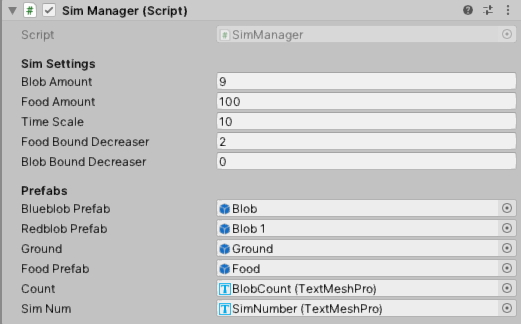

# Primer-Simulation
A project to replicate and build upon the simulations shown in Primer's evolution series, in Unity.

I have watched multiple of Primer's videoes on evolution and have wanted to create my own simulations inspired by his work. 
After searching the web far and wide, I haven't been able to find out how to mimic these simulations.
So I decided to figure it out myself.

Follow my progress here and @axel_sorensen on Twitter, were I will be posting most of my updates

*I am by no means an experienced programmer, so any comments or ideas to optimize the code and reduce repetition, are very welcome*

**RUNNING THE SIMULATION:**

To run the simulation you just need to, copy the Primer Sim folder to your computer, open the unity project and press play!

**THE SIMULATION**

- Each blob starts at 100% energy and looses energy based on their speed every tenth of a second (faster blobs loose energy faster). 
The blob stops moving when energy hits 0%
- Everyday the blobs move randomly around the plane looking for food. 
- When a food item enters the blobs sense radius the blob will move towards the food and eat it.
- If a blob is out of energy or doesnt return home with the food, it is destroyed
- If a blob returns home with 1 food, it will live on to the next day. If a blob returns home with 2 foods it will live and replicate.
- A blobs offspring has a 50% chance of being slightly faster or slower than the parent blob.
- Repeat!

**Sidenote:**
All blobs start with a speed of 10 and the distribution of blobs with different speeds is shown on the distribution chart. 
Faster blobs can get to food faster but also have less time to look for food.
From what I understand the chart should form somewhat of a normal distribution around the most adventageous speed.
At the moment the distribution starts out looking right, and moving up towards higher speeds, but then it start to look random.

**SIM MANAGER:**
(has been changed a bit, but still has the same controls)

The gameobject "Sim Manager" makes it possible to control simulation variables from the inspector window:

- Blob Amount - controls the starting amount of blobs on the plane (refering to the amount of blue blobs, since the red one is hardcoded).
- Food Amount - controls the amount of food instantiated each day.
- Time Scale - controls how fast the simulation runs (default is 1 and if you go much higher than 10 the physics get wacked out).
- Food Bound Decreaser - controls how far from the edges the food is spawned.
- Blob Bound Decreaser - controls how far from the edges the blobs are spawned.

**FUTURE WORK:**

I will continue working on different kinds of simulations. I hope to throw mutations into the mix and graph the blobs to find the most adventageous traits in the given environment.

I hope you can get something out of this! I will be updating the github with new additions and changes.

If you guys have any questions or want a further explanation of the code, let me know! If enough people ask I will make a video explaining some of the key points.

There is still a lot I need to learn and I hope to get there with your help!

Best Regards, 
Axel Sorensen

