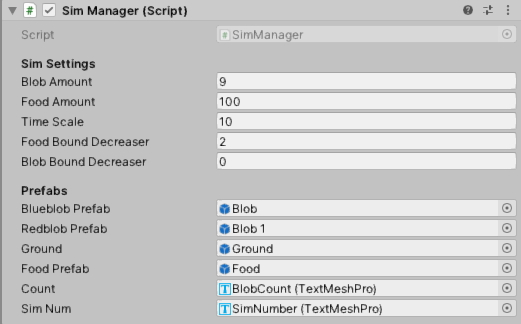
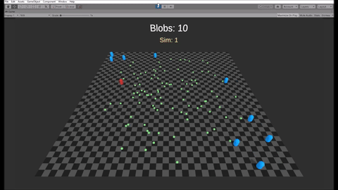
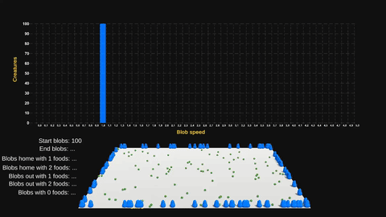
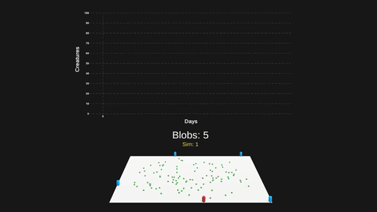

# 🦠 Primer Simulation
Evolution simulations in Unity, inspired by Primer's evolution videos — because after searching the web far and wide, nobody had actually written up how to build these.

*I am by no means an experienced programmer — comments and ideas on optimizing the code are very welcome.*

## Features
- 🧬 Natural selection, live — 10 blobs and 100 foods on a plane, playing out survival of the fittest in real time
- ⚡ Traits that matter — one blob is twice as fast as the rest; watch speed take over the gene pool in ~10 cycles
- 🎛️ Sim Manager — tweak blob count, food count, time scale, and spawn bounds from the inspector, no code required
- 🖱️ Just press play — no setup beyond opening the project

## Installation
```
git clone <this repo>
cd "Primer Sim"
```
Open the folder in Unity (built on 2019.3.7f1).

## Usage
Press ▶️ Play in the Unity editor.

That's the whole simulation:

Each blob starts at 100% energy, losing 1% every tenth of a second — hit 0% and it stops moving.
Every day, blobs wander randomly until food enters their sense radius, then head straight for it.
Out of energy, or fail to make it home with food → destroyed.
Home with 1 food → survives to next day. Home with 2 → survives and replicates.
Repeat!

## Example
The default scene seeds 9 blue blobs and 1 red blob — the red one moves twice as fast. After ~10 cycles:

Day 1:  ●●●●●●●●● ○          (9 blue, 1 red)
Day 5:  ●●●●●○○○○ ○          (red lineage spreading)
Day 10: ○○○○○○○○○ ○          (red has taken over)

Speed is a wildly valuable trait in this environment.

Select Sim Manager in the hierarchy to tune it yourself:



| Field | Controls |
|---|---|
| Blob Amount | Starting number of blue blobs (red is hardcoded) |
| Food Amount | Food instantiated each day |
| Time Scale | Simulation speed (things get physics-wacky above ~10) |
| Food Bound Decreaser | How far from the edges food spawns |
| Blob Bound Decreaser | How far from the edges blobs spawn |

## Demo
**Simulation running**



**Speed mutation taking over the population**



**Which traits win?**



## Built with
- Unity 2019.3.7f1
- C#

## Status
🚧 Early and evolving (pun intended) — next up is mutations, plus graphing blob traits to see what actually wins out in a given environment.

Questions, ideas, or want a video walkthrough of the code? Open an issue, or find me @axel_sorensen on Twitter, where I post progress updates.

Best regards,
Axel Sorensen
